# 📊 Diagramas de Arquitectura PuntoHack MVP

Este documento contiene diagramas técnicos en formato Mermaid para visualizar la arquitectura del sistema.

---

## 📋 Índice

1. [Diagrama de Arquitectura General](#diagrama-de-arquitectura-general)
2. [Flujo de Autenticación](#flujo-de-autenticación)
3. [Sistema RBAC](#sistema-rbac)
4. [Modelo de Datos (ERD)](#modelo-de-datos-erd)
5. [Flujo de User Management](#flujo-de-user-management)
6. [Arquitectura de Módulos](#arquitectura-de-módulos)
7. [Roadmap Visual](#roadmap-visual)
8. [Flujo de Hackathons (Phase 1)](#flujo-de-hackathons-phase-1)
9. [Flujo de Evaluación (Phase 2)](#flujo-de-evaluación-phase-2)

---

## 🏗️ Diagrama de Arquitectura General

### Arquitectura en Capas (Actual - Phase 0)

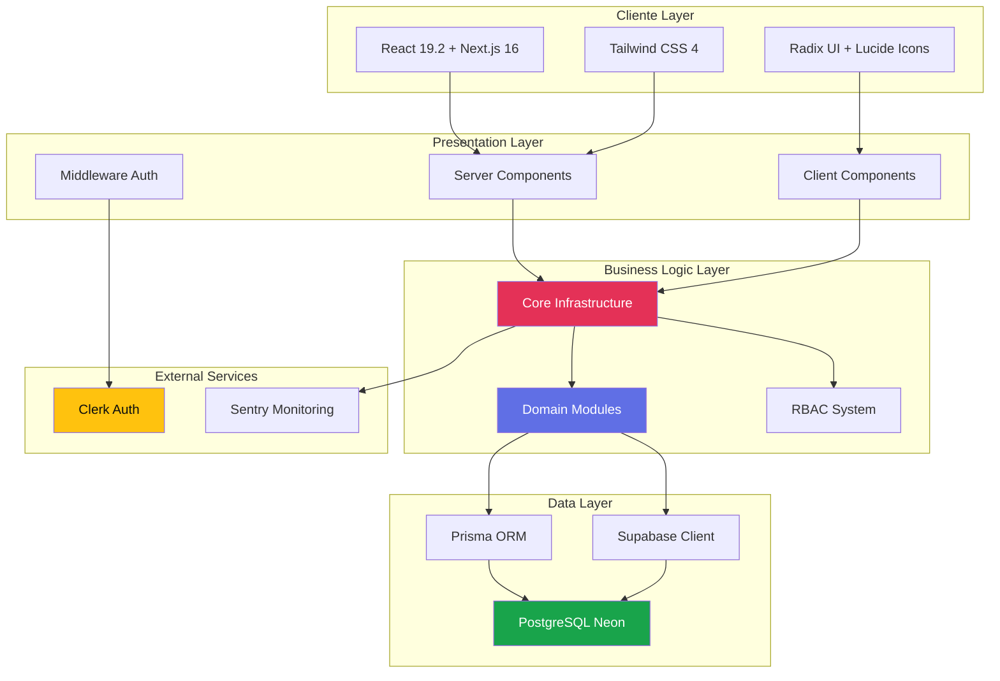
```mermaid
graph TB
    subgraph "Cliente Layer"
        A[React 19.2 + Next.js 16]
        B[Tailwind CSS 4]
        C[Radix UI + Lucide Icons]
    end
    
    subgraph "Presentation Layer"
        D[Server Components]
        E[Client Components]
        F[Middleware Auth]
    end
    
    subgraph "Business Logic Layer"
        G[Core Infrastructure]
        H[Domain Modules]
        I[RBAC System]
    end
    
    subgraph "Data Layer"
        J[Prisma ORM]
        K[Supabase Client]
        L[PostgreSQL Neon]
    end
    
    subgraph "External Services"
        M[Clerk Auth]
        N[Sentry Monitoring]
    end
    
    A --> D
    B --> D
    C --> E
    D --> G
    E --> G
    F --> M
    G --> I
    G --> H
    H --> J
    H --> K
    J --> L
    K --> L
    G --> N
    
    style G fill:#e43157,color:#fff
    style H fill:#606fe5,color:#fff
    style L fill:#19a44b,color:#fff
    style M fill:#ffc20e,color:#0b0d0e
```

---

## 🔐 Flujo de Autenticación

### Onboarding Flow (Con Selección de Rol)

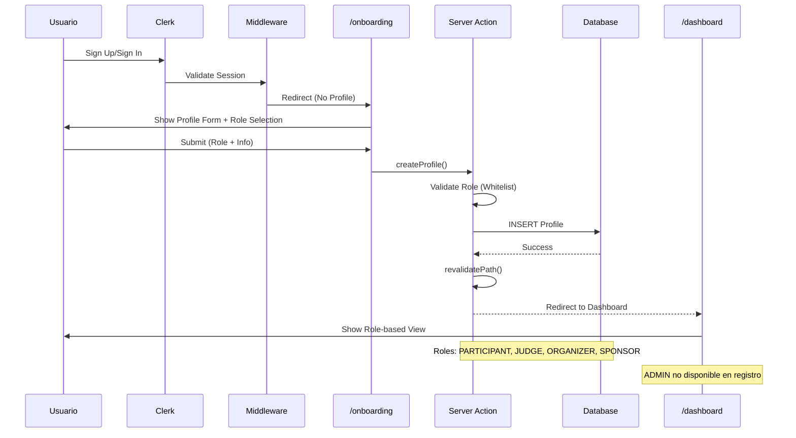
```mermaid
sequenceDiagram
    participant U as Usuario
    participant C as Clerk
    participant MW as Middleware
    participant OB as /onboarding
    participant SA as Server Action
    participant DB as Database
    participant D as /dashboard
    
    U->>C: Sign Up/Sign In
    C->>MW: Validate Session
    MW->>OB: Redirect (No Profile)
    OB->>U: Show Profile Form + Role Selection
    U->>OB: Submit (Role + Info)
    OB->>SA: createProfile()
    SA->>SA: Validate Role (Whitelist)
    SA->>DB: INSERT Profile
    DB-->>SA: Success
    SA->>SA: revalidatePath()
    SA-->>D: Redirect to Dashboard
    D->>U: Show Role-based View
    
    Note over SA,DB: Roles: PARTICIPANT, JUDGE, ORGANIZER, SPONSOR
    Note over D: ADMIN no disponible en registro
```

---

## 🔑 Sistema RBAC

### Jerarquía de Roles

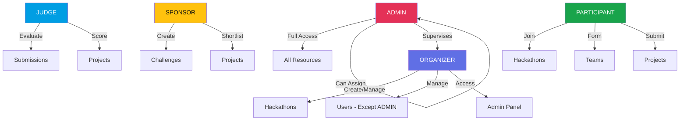
```mermaid
graph TD
    A[ADMIN] -->|Full Access| B[All Resources]
    A -->|Can Assign| A
    
    C[ORGANIZER] -->|Create/Manage| D[Hackathons]
    C -->|Manage| E[Users - Except ADMIN]
    C -->|Access| F[Admin Panel]
    
    A -->|Supervises| C
    
    G[JUDGE] -->|Evaluate| H[Submissions]
    G -->|Score| I[Projects]
    
    J[SPONSOR] -->|Create| K[Challenges]
    J -->|Shortlist| L[Projects]
    
    M[PARTICIPANT] -->|Join| N[Hackathons]
    M -->|Form| O[Teams]
    M -->|Submit| P[Projects]
    
    style A fill:#e43157,color:#fff
    style C fill:#606fe5,color:#fff
    style G fill:#009ee3,color:#fff
    style J fill:#ffc20e,color:#0b0d0e
    style M fill:#19a44b,color:#fff
```

### Matriz de Permisos (Phase 0)

```mermaid
graph LR
    subgraph "Recursos"
        R1[/admin]
        R2[/admin/users]
        R3[Change ADMIN Role]
        R4[Change Other Roles]
        R5[/dashboard]
    end
    
    subgraph "ADMIN"
        A1[✅] --> R1
        A2[✅] --> R2
        A3[✅] --> R3
        A4[✅] --> R4
        A5[✅] --> R5
    end
    
    subgraph "ORGANIZER"
        O1[✅] --> R1
        O2[✅] --> R2
        O3[❌] --> R3
        O4[✅] --> R4
        O5[✅] --> R5
    end
    
    subgraph "JUDGE/SPONSOR/PARTICIPANT"
        J1[❌] -.-> R1
        J2[❌] -.-> R2
        J3[❌] -.-> R3
        J4[❌] -.-> R4
        J5[✅] --> R5
    end
    
    style A1 fill:#19a44b,color:#fff
    style O3 fill:#e43157,color:#fff
    style J1 fill:#999,color:#fff
```

---

## 🗄️ Modelo de Datos (ERD)

### Core Domain (Phase 0-1)

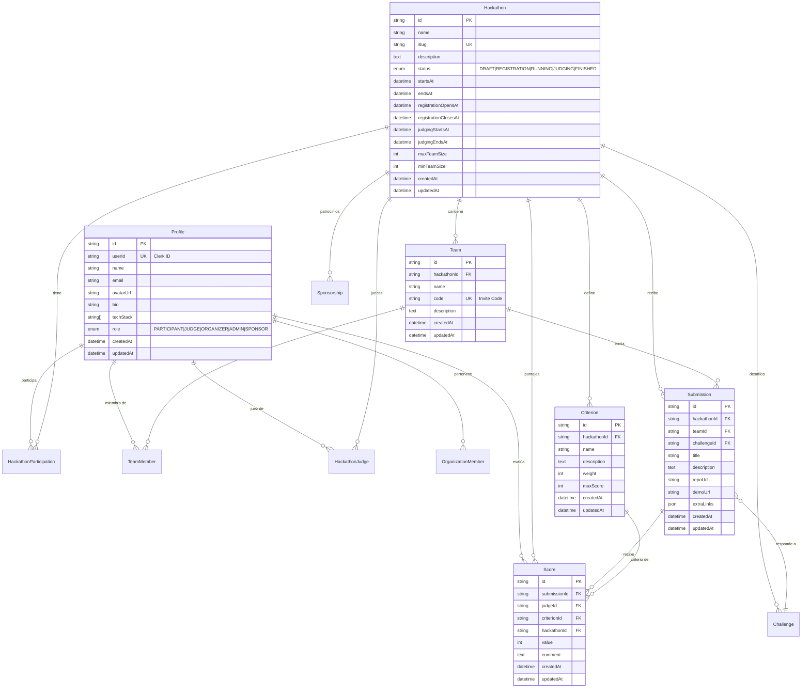
```mermaid
erDiagram
    Profile ||--o{ HackathonParticipation : "participa"
    Profile ||--o{ TeamMember : "miembro de"
    Profile ||--o{ Score : "evalúa"
    Profile ||--o{ HackathonJudge : "juez de"
    Profile ||--o{ OrganizationMember : "pertenece"
    
    Hackathon ||--o{ HackathonParticipation : "tiene"
    Hackathon ||--o{ Team : "contiene"
    Hackathon ||--o{ Submission : "recibe"
    Hackathon ||--o{ Criterion : "define"
    Hackathon ||--o{ Score : "puntajes"
    Hackathon ||--o{ HackathonJudge : "jueces"
    Hackathon ||--o{ Sponsorship : "patrocinios"
    Hackathon ||--o{ Challenge : "desafíos"
    
    Team ||--o{ TeamMember : "compuesto por"
    Team ||--o{ Submission : "envía"
    
    Submission ||--o{ Score : "recibe"
    Submission }o--|| Challenge : "responde a"
    
    Criterion ||--o{ Score : "criterio de"
    
    Profile {
        string id PK
        string userId UK "Clerk ID"
        string name
        string email
        string avatarUrl
        string bio
        string[] techStack
        enum role "PARTICIPANT|JUDGE|ORGANIZER|ADMIN|SPONSOR"
        datetime createdAt
        datetime updatedAt
    }
    
    Hackathon {
        string id PK
        string name
        string slug UK
        text description
        enum status "DRAFT|REGISTRATION|RUNNING|JUDGING|FINISHED"
        datetime startsAt
        datetime endsAt
        datetime registrationOpensAt
        datetime registrationClosesAt
        datetime judgingStartsAt
        datetime judgingEndsAt
        int maxTeamSize
        int minTeamSize
        datetime createdAt
        datetime updatedAt
    }
    
    Team {
        string id PK
        string hackathonId FK
        string name
        string code UK "Invite Code"
        text description
        datetime createdAt
        datetime updatedAt
    }
    
    Submission {
        string id PK
        string hackathonId FK
        string teamId FK
        string challengeId FK
        string title
        text description
        string repoUrl
        string demoUrl
        json extraLinks
        datetime createdAt
        datetime updatedAt
    }
    
    Criterion {
        string id PK
        string hackathonId FK
        string name
        text description
        int weight
        int maxScore
        datetime createdAt
        datetime updatedAt
    }
    
    Score {
        string id PK
        string submissionId FK
        string judgeId FK
        string criterionId FK
        string hackathonId FK
        int value
        text comment
        datetime createdAt
        datetime updatedAt
    }
```

### Sponsor Domain (Phase 3)

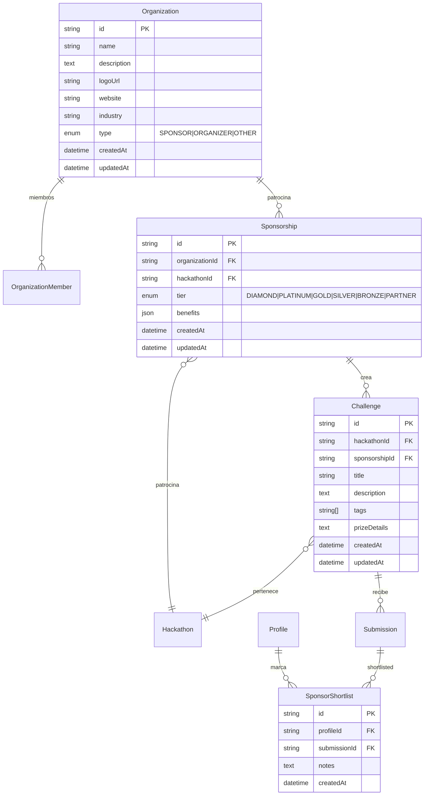
```mermaid
erDiagram
    Organization ||--o{ OrganizationMember : "miembros"
    Organization ||--o{ Sponsorship : "patrocina"
    
    Sponsorship ||--o{ Challenge : "crea"
    Sponsorship }o--|| Hackathon : "patrocina"
    
    Challenge }o--|| Hackathon : "pertenece"
    Challenge ||--o{ Submission : "recibe"
    
    Profile ||--o{ SponsorShortlist : "marca"
    Submission ||--o{ SponsorShortlist : "shortlisted"
    
    Organization {
        string id PK
        string name
        text description
        string logoUrl
        string website
        string industry
        enum type "SPONSOR|ORGANIZER|OTHER"
        datetime createdAt
        datetime updatedAt
    }
    
    Sponsorship {
        string id PK
        string organizationId FK
        string hackathonId FK
        enum tier "DIAMOND|PLATINUM|GOLD|SILVER|BRONZE|PARTNER"
        json benefits
        datetime createdAt
        datetime updatedAt
    }
    
    Challenge {
        string id PK
        string hackathonId FK
        string sponsorshipId FK
        string title
        text description
        string[] tags
        text prizeDetails
        datetime createdAt
        datetime updatedAt
    }
    
    SponsorShortlist {
        string id PK
        string profileId FK
        string submissionId FK
        text notes
        datetime createdAt
    }
```

---

## 👥 Flujo de User Management

### Cambio de Rol (Admin Panel)

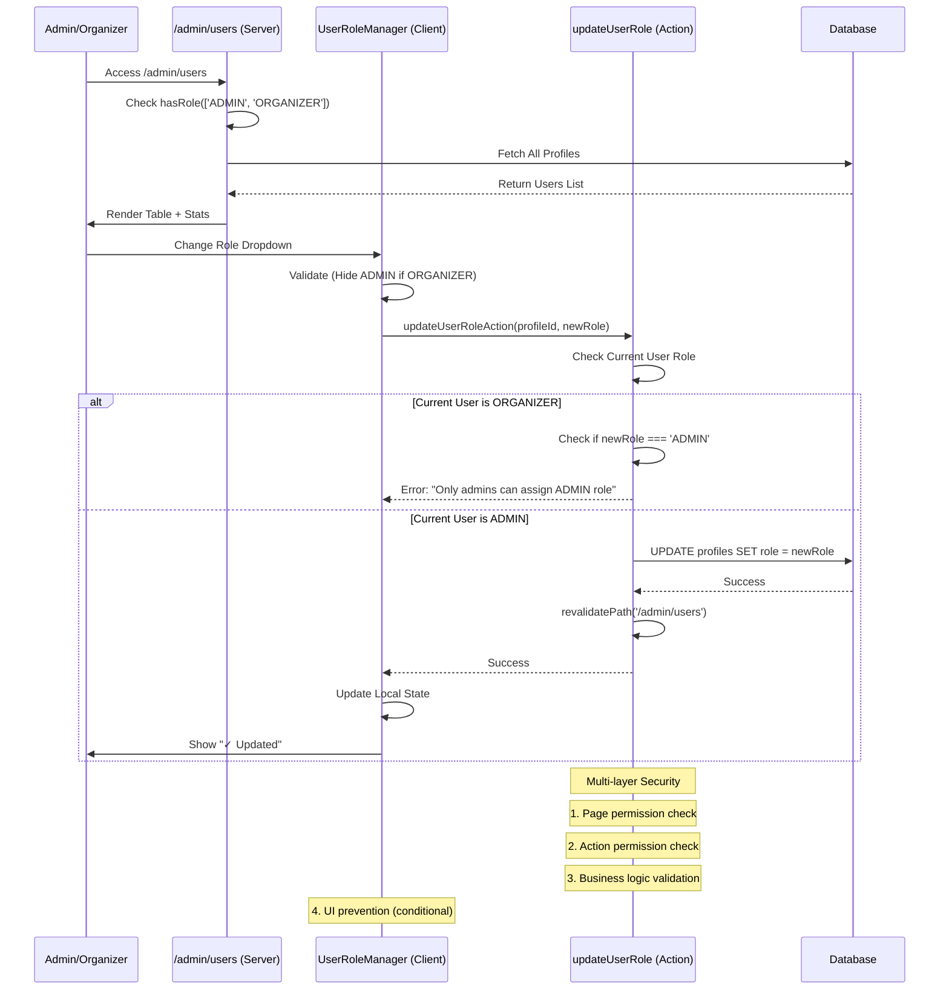
```mermaid
sequenceDiagram
    participant A as Admin/Organizer
    participant P as /admin/users (Server)
    participant C as UserRoleManager (Client)
    participant SA as updateUserRole (Action)
    participant DB as Database
    
    A->>P: Access /admin/users
    P->>P: Check hasRole(['ADMIN', 'ORGANIZER'])
    P->>DB: Fetch All Profiles
    DB-->>P: Return Users List
    P->>A: Render Table + Stats
    
    A->>C: Change Role Dropdown
    C->>C: Validate (Hide ADMIN if ORGANIZER)
    C->>SA: updateUserRoleAction(profileId, newRole)
    
    SA->>SA: Check Current User Role
    
    alt Current User is ORGANIZER
        SA->>SA: Check if newRole === 'ADMIN'
        SA-->>C: Error: "Only admins can assign ADMIN role"
    else Current User is ADMIN
        SA->>DB: UPDATE profiles SET role = newRole
        DB-->>SA: Success
        SA->>SA: revalidatePath('/admin/users')
        SA-->>C: Success
        C->>C: Update Local State
        C->>A: Show "✓ Updated"
    end
    
    Note over SA: Multi-layer Security
    Note over SA: 1. Page permission check
    Note over SA: 2. Action permission check
    Note over SA: 3. Business logic validation
    Note over C: 4. UI prevention (conditional)
```

---

## 📦 Arquitectura de Módulos

### Patrón Modular (Actual + Futuro)

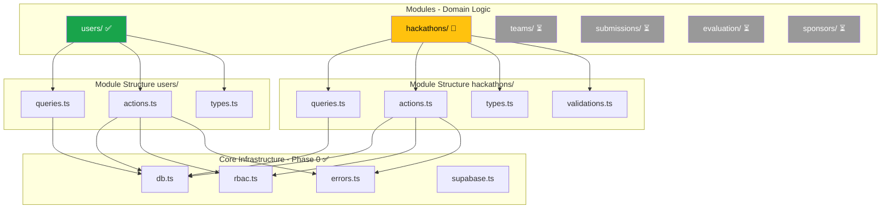
```mermaid
graph TB
    subgraph "Core Infrastructure - Phase 0 ✅"
        C1[rbac.ts]
        C2[errors.ts]
        C3[db.ts]
        C4[supabase.ts]
    end
    
    subgraph "Modules - Domain Logic"
        M1[users/ ✅]
        M2[hackathons/ 🔨]
        M3[teams/ ⏳]
        M4[submissions/ ⏳]
        M5[evaluation/ ⏳]
        M6[sponsors/ ⏳]
    end
    
    subgraph "Module Structure users/"
        U1[queries.ts]
        U2[actions.ts]
        U3[types.ts]
    end
    
    subgraph "Module Structure hackathons/"
        H1[queries.ts]
        H2[actions.ts]
        H3[types.ts]
        H4[validations.ts]
    end
    
    M1 --> U1
    M1 --> U2
    M1 --> U3
    
    M2 --> H1
    M2 --> H2
    M2 --> H3
    M2 --> H4
    
    U1 --> C3
    U2 --> C3
    H1 --> C3
    H2 --> C3
    
    U2 --> C1
    H2 --> C1
    
    U2 --> C2
    H2 --> C2
    
    style M1 fill:#19a44b,color:#fff
    style M2 fill:#ffc20e,color:#0b0d0e
    style M3 fill:#999,color:#fff
    style M4 fill:#999,color:#fff
    style M5 fill:#999,color:#fff
    style M6 fill:#999,color:#fff
```

### Flujo de Datos en Módulo

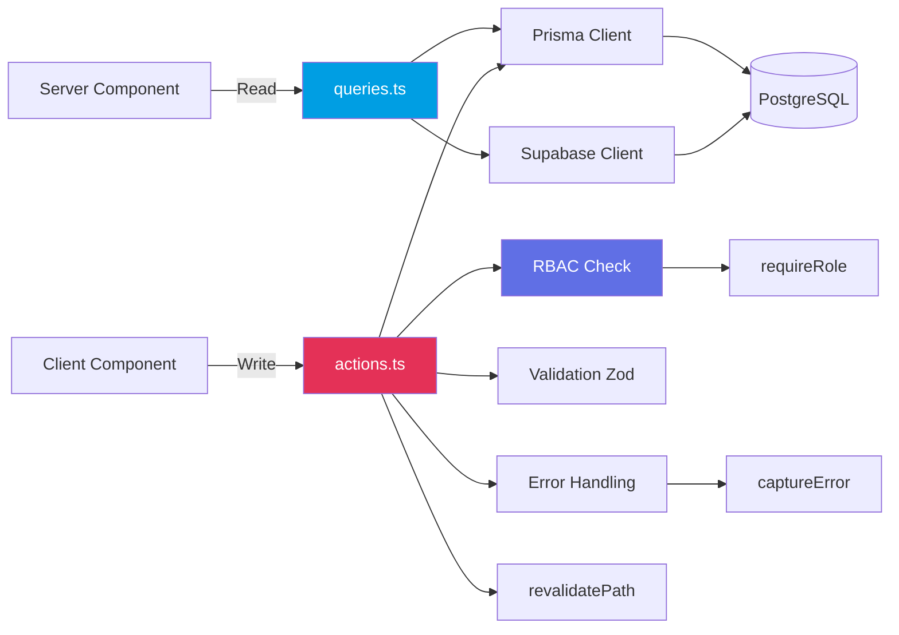
```mermaid
graph LR
    A[Server Component] -->|Read| B[queries.ts]
    C[Client Component] -->|Write| D[actions.ts]
    
    B --> E[Prisma Client]
    B --> F[Supabase Client]
    D --> E
    
    E --> G[(PostgreSQL)]
    F --> G
    
    D --> H[RBAC Check]
    D --> I[Validation Zod]
    D --> J[Error Handling]
    
    H --> K[requireRole]
    J --> L[captureError]
    
    D --> M[revalidatePath]
    
    style B fill:#009ee3,color:#fff
    style D fill:#e43157,color:#fff
    style H fill:#606fe5,color:#fff
```

---

## 🗓️ Roadmap Visual

### Timeline de Desarrollo

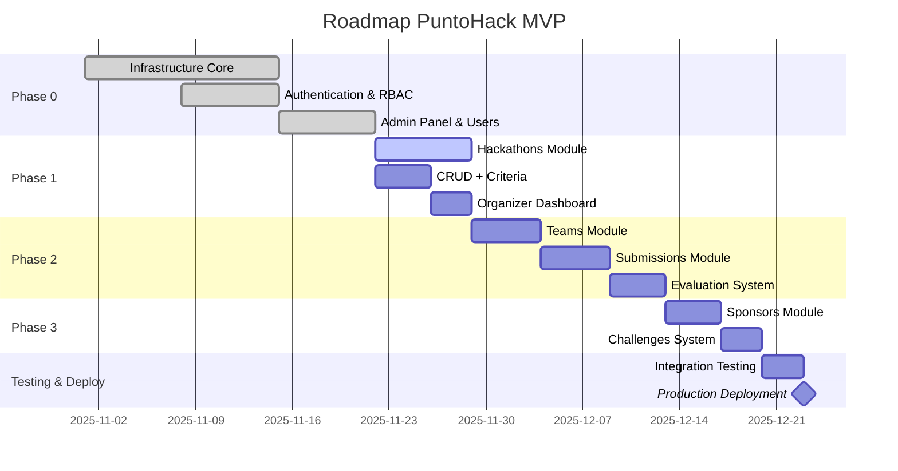
```mermaid
gantt
    title Roadmap PuntoHack MVP
    dateFormat YYYY-MM-DD
    section Phase 0
    Infrastructure Core        :done, p0, 2025-11-01, 14d
    Authentication & RBAC      :done, p0a, 2025-11-08, 7d
    Admin Panel & Users        :done, p0b, 2025-11-15, 7d
    
    section Phase 1
    Hackathons Module          :active, p1, 2025-11-22, 7d
    CRUD + Criteria            :p1a, 2025-11-22, 4d
    Organizer Dashboard        :p1b, 2025-11-26, 3d
    
    section Phase 2
    Teams Module               :p2, 2025-11-29, 5d
    Submissions Module         :p2a, 2025-12-04, 5d
    Evaluation System          :p2b, 2025-12-09, 4d
    
    section Phase 3
    Sponsors Module            :p3, 2025-12-13, 4d
    Challenges System          :p3a, 2025-12-17, 3d
    
    section Testing & Deploy
    Integration Testing        :p4, 2025-12-20, 3d
    Production Deployment      :milestone, 2025-12-23, 0d
```

### Estado de Completitud por Fase

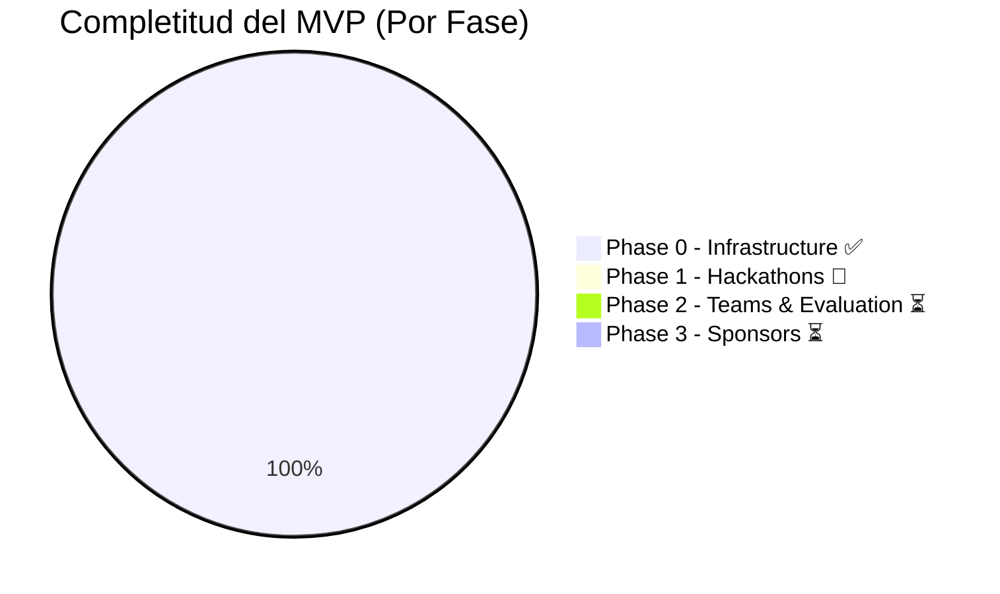
```mermaid
pie title Completitud del MVP (Por Fase)
    "Phase 0 - Infrastructure ✅" : 100
    "Phase 1 - Hackathons 🔨" : 0
    "Phase 2 - Teams & Evaluation ⏳" : 0
    "Phase 3 - Sponsors ⏳" : 0
```

---

## 🎪 Flujo de Hackathons (Phase 1)

### Ciclo de Vida de Hackathon

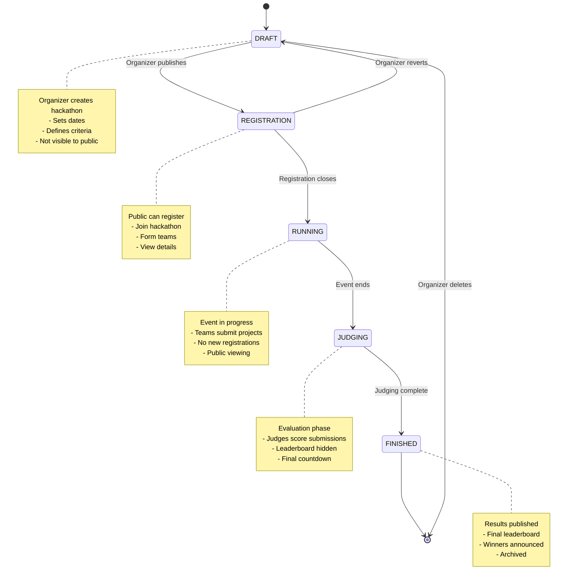
```mermaid
stateDiagram-v2
    [*] --> DRAFT
    DRAFT --> REGISTRATION : Organizer publishes
    REGISTRATION --> RUNNING : Registration closes
    RUNNING --> JUDGING : Event ends
    JUDGING --> FINISHED : Judging complete
    FINISHED --> [*]
    
    DRAFT --> [*] : Organizer deletes
    REGISTRATION --> DRAFT : Organizer reverts
    
    note right of DRAFT
        Organizer creates hackathon
        - Sets dates
        - Defines criteria
        - Not visible to public
    end note
    
    note right of REGISTRATION
        Public can register
        - Join hackathon
        - Form teams
        - View details
    end note
    
    note right of RUNNING
        Event in progress
        - Teams submit projects
        - No new registrations
        - Public viewing
    end note
    
    note right of JUDGING
        Evaluation phase
        - Judges score submissions
        - Leaderboard hidden
        - Final countdown
    end note
    
    note right of FINISHED
        Results published
        - Final leaderboard
        - Winners announced
        - Archived
    end note
```

### CRUD Flow (Organizer)

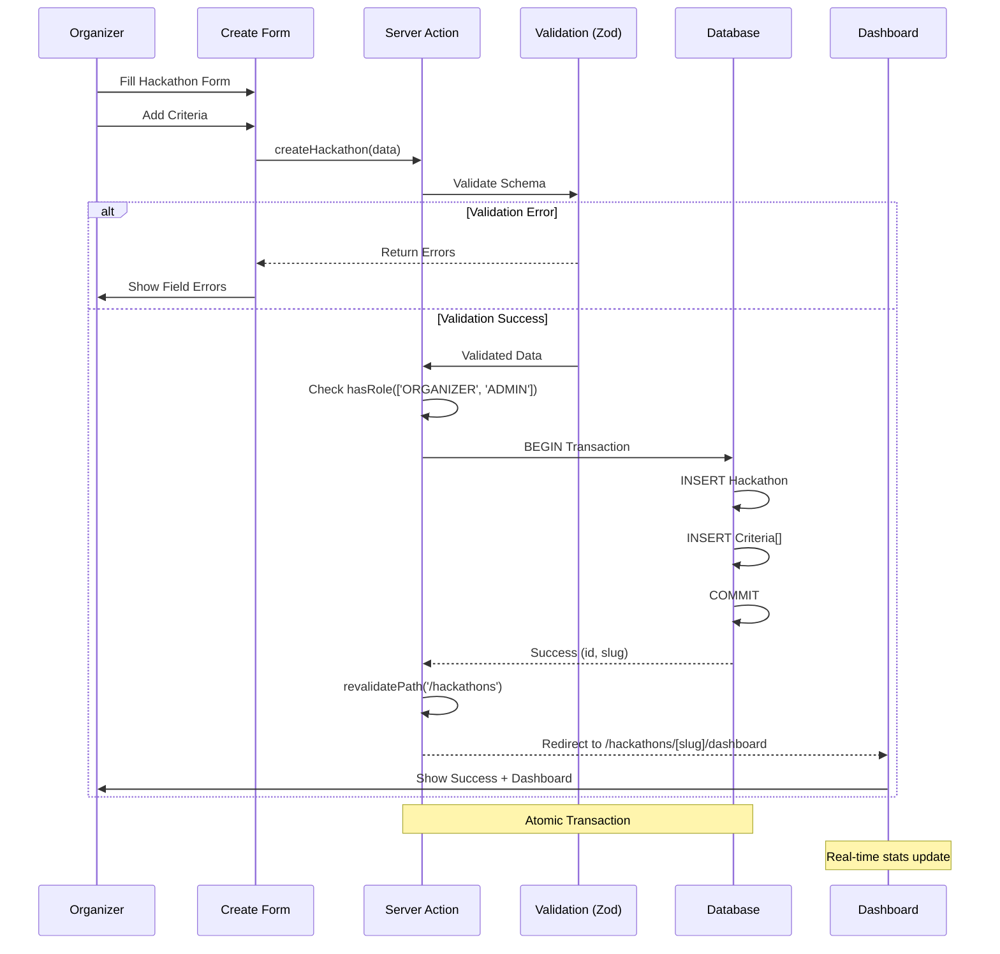
```mermaid
sequenceDiagram
    participant O as Organizer
    participant CF as Create Form
    participant SA as Server Action
    participant V as Validation (Zod)
    participant DB as Database
    participant D as Dashboard
    
    O->>CF: Fill Hackathon Form
    O->>CF: Add Criteria
    CF->>SA: createHackathon(data)
    SA->>V: Validate Schema
    
    alt Validation Error
        V-->>CF: Return Errors
        CF->>O: Show Field Errors
    else Validation Success
        V->>SA: Validated Data
        SA->>SA: Check hasRole(['ORGANIZER', 'ADMIN'])
        SA->>DB: BEGIN Transaction
        DB->>DB: INSERT Hackathon
        DB->>DB: INSERT Criteria[]
        DB->>DB: COMMIT
        DB-->>SA: Success (id, slug)
        SA->>SA: revalidatePath('/hackathons')
        SA-->>D: Redirect to /hackathons/[slug]/dashboard
        D->>O: Show Success + Dashboard
    end
    
    Note over SA,DB: Atomic Transaction
    Note over D: Real-time stats update
```

---

## ⚖️ Flujo de Evaluación (Phase 2)

### Judge Assignment & Scoring

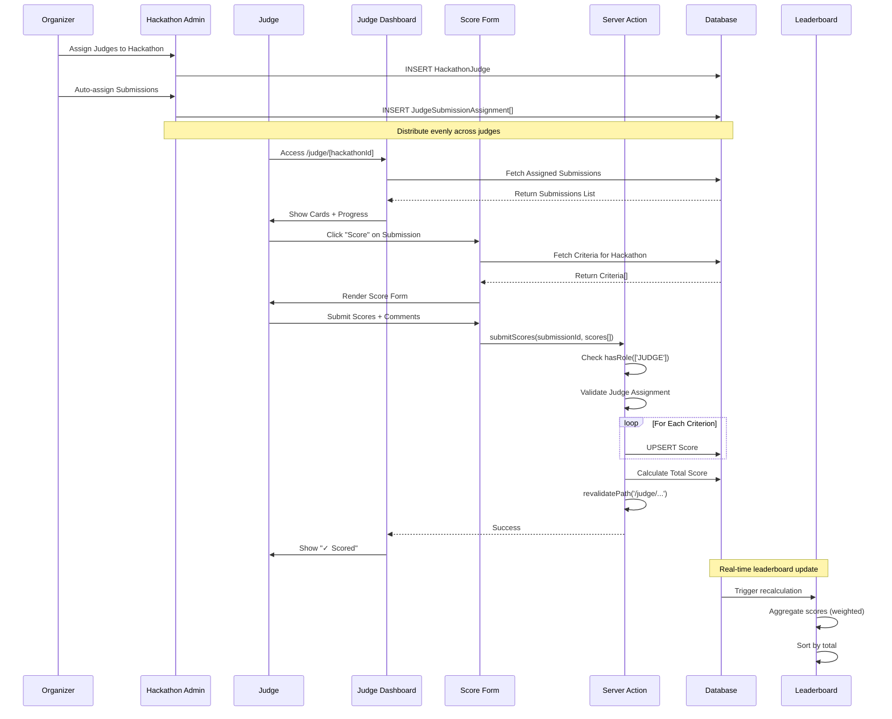
```mermaid
sequenceDiagram
    participant O as Organizer
    participant HA as Hackathon Admin
    participant J as Judge
    participant JD as Judge Dashboard
    participant SF as Score Form
    participant SA as Server Action
    participant DB as Database
    participant LB as Leaderboard
    
    O->>HA: Assign Judges to Hackathon
    HA->>DB: INSERT HackathonJudge
    
    O->>HA: Auto-assign Submissions
    HA->>DB: INSERT JudgeSubmissionAssignment[]
    
    Note over HA,DB: Distribute evenly across judges
    
    J->>JD: Access /judge/[hackathonId]
    JD->>DB: Fetch Assigned Submissions
    DB-->>JD: Return Submissions List
    JD->>J: Show Cards + Progress
    
    J->>SF: Click "Score" on Submission
    SF->>DB: Fetch Criteria for Hackathon
    DB-->>SF: Return Criteria[]
    SF->>J: Render Score Form
    
    J->>SF: Submit Scores + Comments
    SF->>SA: submitScores(submissionId, scores[])
    SA->>SA: Check hasRole(['JUDGE'])
    SA->>SA: Validate Judge Assignment
    
    loop For Each Criterion
        SA->>DB: UPSERT Score
    end
    
    SA->>DB: Calculate Total Score
    SA->>SA: revalidatePath('/judge/...')
    SA-->>JD: Success
    JD->>J: Show "✓ Scored"
    
    Note over DB,LB: Real-time leaderboard update
    DB->>LB: Trigger recalculation
    LB->>LB: Aggregate scores (weighted)
    LB->>LB: Sort by total
```

### Scoring Algorithm

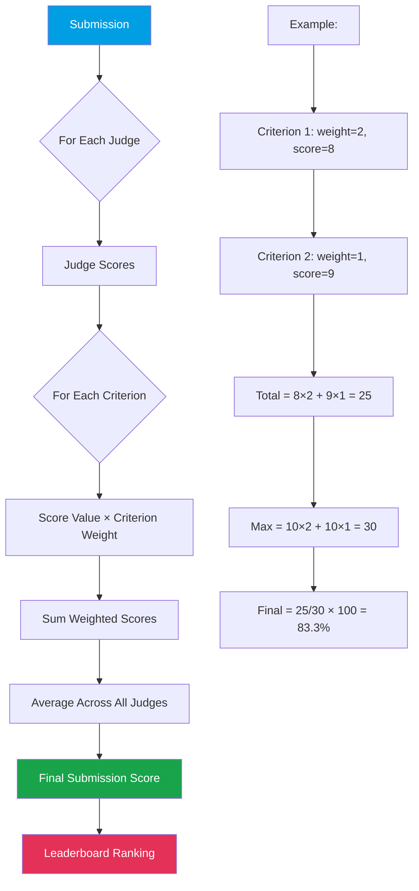
```mermaid
graph TD
    A[Submission] --> B{For Each Judge}
    B --> C[Judge Scores]
    C --> D{For Each Criterion}
    D --> E[Score Value × Criterion Weight]
    E --> F[Sum Weighted Scores]
    F --> G[Average Across All Judges]
    G --> H[Final Submission Score]
    
    H --> I[Leaderboard Ranking]
    
    style A fill:#009ee3,color:#fff
    style H fill:#19a44b,color:#fff
    style I fill:#e43157,color:#fff
    
    Note1[Example:] --> Note2[Criterion 1: weight=2, score=8]
    Note2 --> Note3[Criterion 2: weight=1, score=9]
    Note3 --> Note4[Total = 8×2 + 9×1 = 25]
    Note4 --> Note5[Max = 10×2 + 10×1 = 30]
    Note5 --> Note6[Final = 25/30 × 100 = 83.3%]
```

---

## 🔄 Flujo de Integración Completo

### User Journey (Participant)

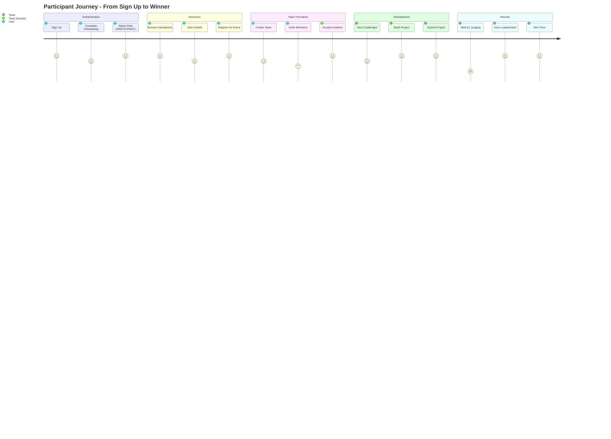
```mermaid
journey
    title Participant Journey - From Sign Up to Winner
    section Authentication
      Sign Up: 5: User
      Complete Onboarding: 4: User
      Select Role (PARTICIPANT): 5: User
    section Discovery
      Browse Hackathons: 5: User
      View Details: 4: User
      Register for Event: 5: User
    section Team Formation
      Create Team: 4: User
      Invite Members: 3: User
      Accept Invitation: 5: Team Member
    section Development
      View Challenges: 4: Team
      Build Project: 5: Team
      Submit Project: 5: Team
    section Results
      Wait for Judging: 2: Team
      View Leaderboard: 5: Team
      Win Prize: 5: Team
```

### Multi-Role Interaction

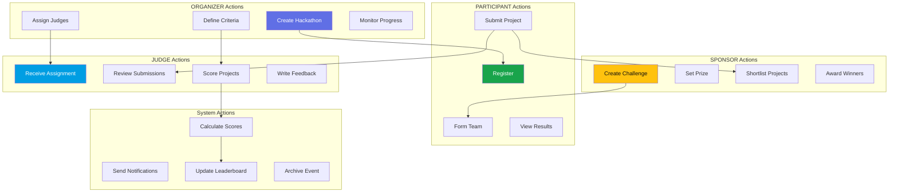
```mermaid
graph TB
    subgraph "ORGANIZER Actions"
        O1[Create Hackathon]
        O2[Define Criteria]
        O3[Assign Judges]
        O4[Monitor Progress]
    end
    
    subgraph "PARTICIPANT Actions"
        P1[Register]
        P2[Form Team]
        P3[Submit Project]
        P4[View Results]
    end
    
    subgraph "JUDGE Actions"
        J1[Receive Assignment]
        J2[Review Submissions]
        J3[Score Projects]
        J4[Write Feedback]
    end
    
    subgraph "SPONSOR Actions"
        S1[Create Challenge]
        S2[Set Prize]
        S3[Shortlist Projects]
        S4[Award Winners]
    end
    
    subgraph "System Actions"
        SY1[Send Notifications]
        SY2[Calculate Scores]
        SY3[Update Leaderboard]
        SY4[Archive Event]
    end
    
    O1 --> P1
    O2 --> J3
    O3 --> J1
    P3 --> J2
    J3 --> SY2
    SY2 --> SY3
    S1 --> P2
    P3 --> S3
    
    style O1 fill:#606fe5,color:#fff
    style P1 fill:#19a44b,color:#fff
    style J1 fill:#009ee3,color:#fff
    style S1 fill:#ffc20e,color:#0b0d0e
```

---

## 📊 Métricas de Arquitectura

### Complejidad por Módulo (Estimado)

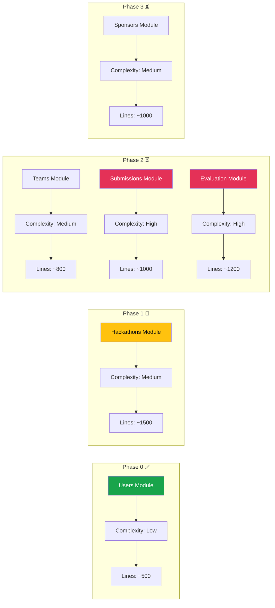
```mermaid
graph LR
    subgraph "Phase 0 ✅"
        M0[Users Module]
        M0 --> C0[Complexity: Low]
        C0 --> L0[Lines: ~500]
    end
    
    subgraph "Phase 1 🔨"
        M1[Hackathons Module]
        M1 --> C1[Complexity: Medium]
        C1 --> L1[Lines: ~1500]
    end
    
    subgraph "Phase 2 ⏳"
        M2A[Teams Module]
        M2B[Submissions Module]
        M2C[Evaluation Module]
        M2A --> C2A[Complexity: Medium]
        M2B --> C2B[Complexity: High]
        M2C --> C2C[Complexity: High]
        C2A --> L2A[Lines: ~800]
        C2B --> L2B[Lines: ~1000]
        C2C --> L2C[Lines: ~1200]
    end
    
    subgraph "Phase 3 ⏳"
        M3[Sponsors Module]
        M3 --> C3[Complexity: Medium]
        C3 --> L3[Lines: ~1000]
    end
    
    style M0 fill:#19a44b,color:#fff
    style M1 fill:#ffc20e,color:#0b0d0e
    style M2B fill:#e43157,color:#fff
    style M2C fill:#e43157,color:#fff
```

### Dependency Graph

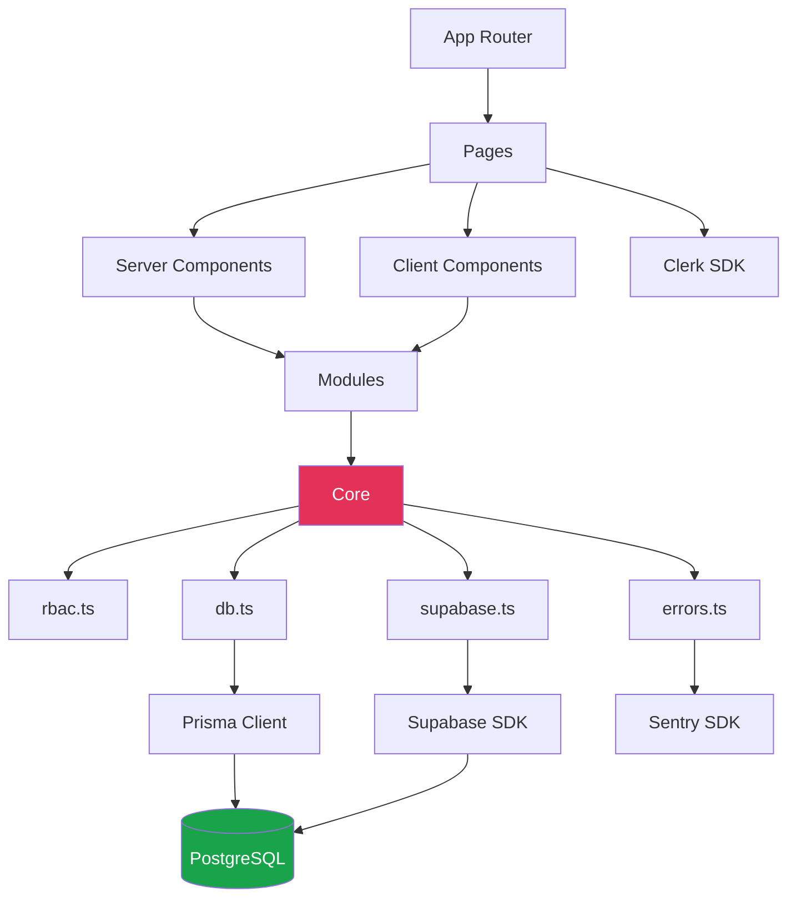
```mermaid
graph TD
    APP[App Router] --> PAGES[Pages]
    PAGES --> SC[Server Components]
    PAGES --> CC[Client Components]
    
    SC --> MOD[Modules]
    CC --> MOD
    
    MOD --> CORE[Core]
    
    CORE --> RBAC[rbac.ts]
    CORE --> ERR[errors.ts]
    CORE --> DB[db.ts]
    CORE --> SB[supabase.ts]
    
    DB --> PRISMA[Prisma Client]
    SB --> SUPABASE[Supabase SDK]
    
    PRISMA --> PG[(PostgreSQL)]
    SUPABASE --> PG
    
    ERR --> SENTRY[Sentry SDK]
    
    PAGES --> CLERK[Clerk SDK]
    
    style CORE fill:#e43157,color:#fff
    style PG fill:#19a44b,color:#fff
```

---

## 🎯 Próximos Pasos

### Phase 1 Implementation Flow

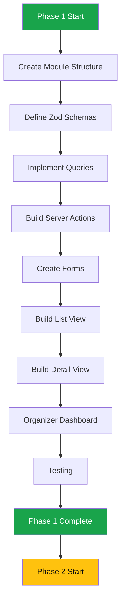
```mermaid
graph TD
    START[Phase 1 Start] --> T1[Create Module Structure]
    T1 --> T2[Define Zod Schemas]
    T2 --> T3[Implement Queries]
    T3 --> T4[Build Server Actions]
    T4 --> T5[Create Forms]
    T5 --> T6[Build List View]
    T6 --> T7[Build Detail View]
    T7 --> T8[Organizer Dashboard]
    T8 --> T9[Testing]
    T9 --> T10[Phase 1 Complete]
    
    T10 --> NEXT[Phase 2 Start]
    
    style START fill:#19a44b,color:#fff
    style T10 fill:#19a44b,color:#fff
    style NEXT fill:#ffc20e,color:#0b0d0e
```

---

**Última Actualización**: 22 de noviembre, 2025  
**Versión**: 1.0.0  
**Notas**: Diagramas renderizables en GitHub, GitLab, y cualquier visor Mermaid compatible.
